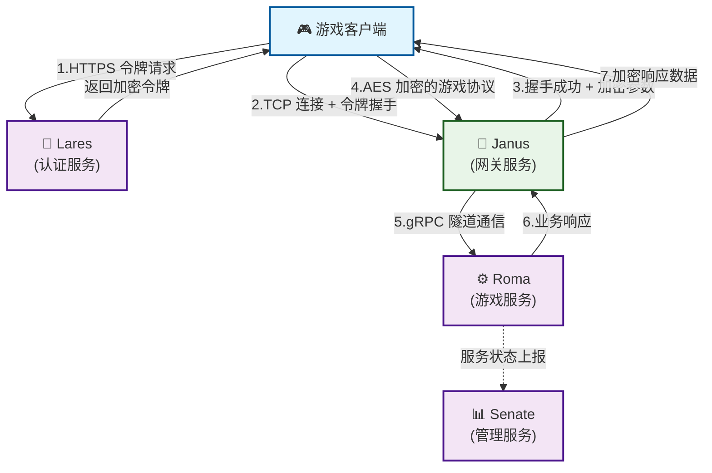
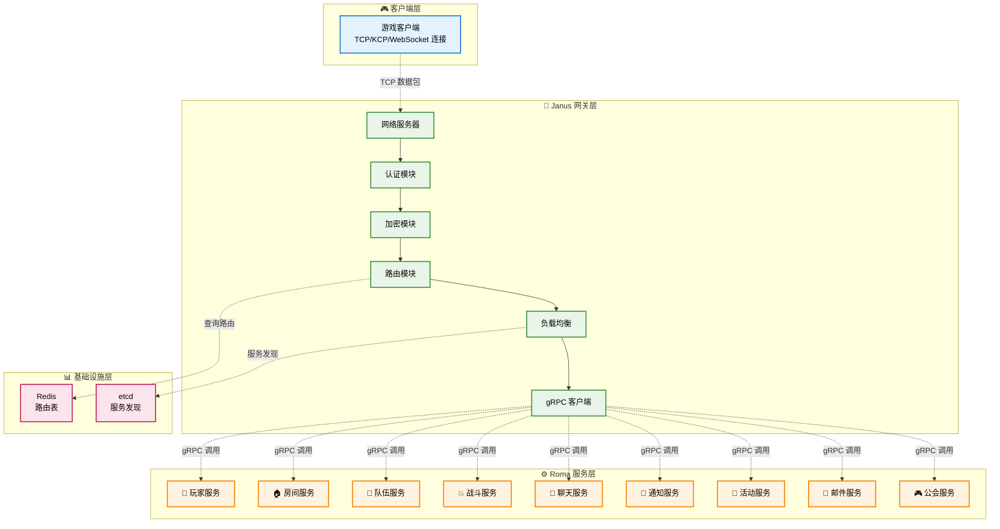
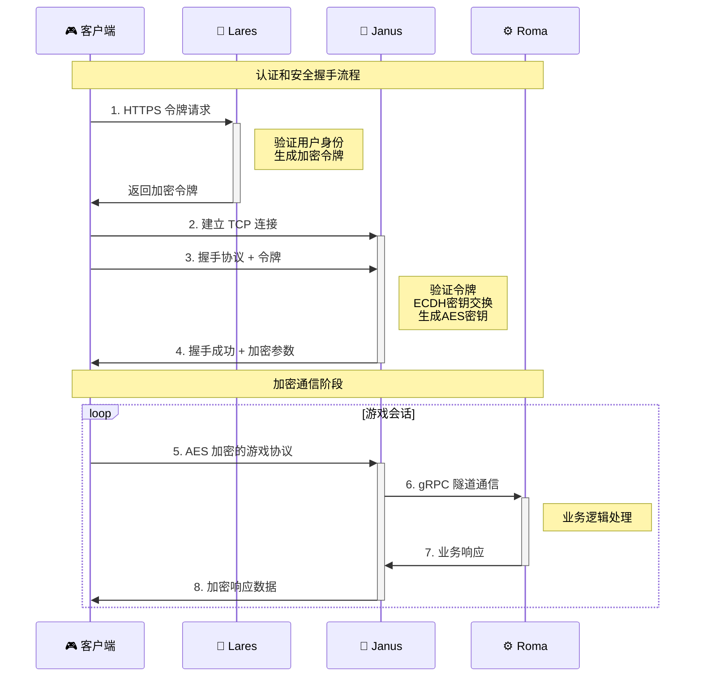
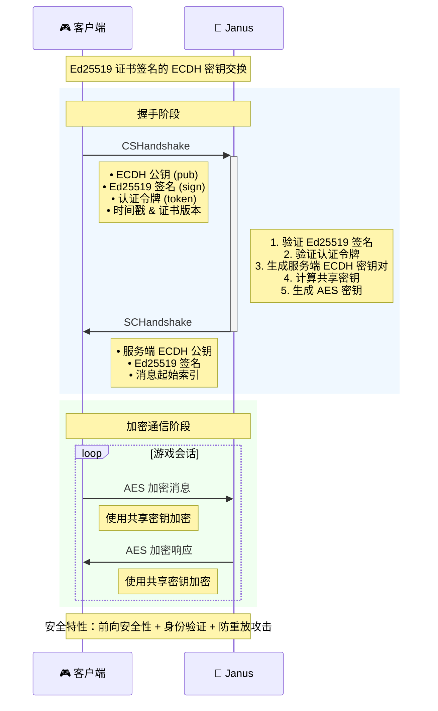

<div align="center">
  <h1>🔰 JANUS 网关服务</h1>
  <p><em>go-pantheon 生态系统的高性能网关服务框架</em></p>
</div>

<p align="center">
<a href="https://github.com/go-pantheon/janus/actions/workflows/test.yml"></a>
<a href="https://github.com/go-pantheon/janus/releases"></a>
<a href="https://pkg.go.dev/github.com/go-pantheon/janus"></a>
<a href="https://goreportcard.com/report/github.com/go-pantheon/janus"></a>
<a href="https://github.com/go-pantheon/janus/blob/main/LICENSE"></a>
<a href="https://deepwiki.com/go-pantheon/janus"></a>
</p>

<p align="center">
  <a href="README.md">English</a> | <a href="README-zh.md">中文</a>
</p>

## 关于 Janus

Janus 是基于微服务架构的高性能网关服务框架，采用 Go 语言开发。该框架旨在为客户端和后端服务之间提供可扩展且可靠的连接层，支持多种协议和高效的请求路由。Janus 是 go-pantheon 生态系统的核心组件，负责实现客户端连接处理和请求转发。

更多信息请查看：[deepwiki/go-pantheon/janus](https://deepwiki.com/go-pantheon/janus)

## 关于 go-pantheon 生态系统

**go-pantheon** 是一个开箱即用的游戏服务器框架，基于微服务架构提供高性能、高可用的游戏服务器集群解决方案。Janus 作为网关服务，与其他核心服务协作构成完整的游戏服务生态系统：

- **Roma**: 游戏核心逻辑服务
- **Janus**: 网关服务，负责客户端连接处理和请求转发
- **Lares**: 账户服务，负责用户认证和账户管理
- **Senate**: 后台管理服务，提供运营管理接口

## 核心特性

- 🚀 高性能 TCP 连接管理和协议处理
- 🔄 高效的请求路由和负载均衡
- 🛡️ 基于加密令牌的身份验证和握手验证
- 🔒 基于Ed25519证书签名的ECDH密钥交换和AES加密通信
- 📊 实时监控和分布式链路追踪
- 🔌 基于中间件和模块化的可扩展架构
- 📈 基于工作池和对象池的高并发架构设计
- 🔍 TCP 和 gRPC 之间的协议转换
- 📦 支持数据压缩和版本控制
- 🎯 智能消息路由和推送机制

## 服务层特性

- **客户端连接管理**: 高性能 TCP 服务器，支持长连接和连接池
- **协议转换**: 无缝的 TCP 到 gRPC 协议转换
- **安全通信**: 基于Ed25519证书签名的ECDH密钥交换，握手后使用AES加密
- **负载均衡**: 基于 Redis 的路由表实现智能负载均衡
- **消息压缩**: 支持 zlib 压缩减少网络传输
- **版本控制**: 支持协议版本管理和数据版本控制
- **推送服务**: 实时消息推送和事件通知
- **健康检查**: 自动服务发现和健康状态监控

## 游戏模块支持

Janus 支持以下游戏业务模块：

| 模块         | 描述     | 功能                       |
| ------------ | -------- | -------------------------- |
| **System**   | 系统模块 | 握手、心跳、错误处理、登出 |
| **Dev**      | 开发模块 | GM 命令执行、调试功能      |
| **Player**   | 玩家模块 | 玩家数据同步、基础操作     |
| **Room**     | 房间模块 | 房间创建、加入、管理等功能 |
| **Team**     | 队伍模块 | 队伍创建、加入、管理等功能 |
| **Fight**    | 战斗模块 | 战斗系统相关功能           |
| **Chat**     | 聊天模块 | 聊天系统相关功能           |
| **Notice**   | 通知模块 | 通知系统相关功能           |
| **Activity** | 活动模块 | 活动系统相关功能           |
| **Mail**     | 邮件模块 | 邮件系统相关功能           |
| **Guild**    | 公会模块 | 公会系统相关功能           |

## 系统架构

### 系统架构总览

**组件关系图：**



### 网络协议架构

**分层架构图，以 TCP 协议为例：**



### 认证和安全流程

**完整认证时序图：**



## 项目概述

Janus 框架基于高性能网络库构建，针对高并发进行优化，支持客户端连接的 TCP 和 WebSocket 协议，以及后端服务通信的 gRPC 协议。框架设计遵循领域驱动设计(DDD)原则和整洁架构方法，通过无状态设计和负载均衡能力实现高可用性和可扩展性。

## 技术栈

Janus 使用以下核心技术：

| 技术/组件     | 用途               | 版本    |
| ------------- | ------------------ | ------- |
| Go            | 主要开发语言       | 1.24+   |
| Kratos        | 微服务框架         | v2.8.4  |
| gRPC          | 后端服务通信       | v1.73.0 |
| Protobuf      | 数据序列化         | v1.36.6 |
| etcd          | 服务发现与注册     | v3.6.1  |
| Redis         | 连接追踪和路由表   | v9.10.0 |
| OpenTelemetry | 分布式链路追踪     | v1.36.0 |
| Prometheus    | 监控系统           | v1.22.0 |
| Google Wire   | 依赖注入           | v0.6.0  |
| zap           | 日志记录           | v1.27.0 |
| Buf           | API 管理           | Latest  |
| fabrica-kit   | go-pantheon 工具包 | v0.0.10 |
| fabrica-net   | go-pantheon 网络库 | v0.0.11 |
| fabrica-util  | go-pantheon 工具库 | v0.0.18 |

## 关键特性

- **高性能 TCP 服务器**: 为游戏流量优化的自定义 TCP 服务器，基于工作池架构支持高并发连接
- **安全协议转换**: TCP 和 gRPC 协议间的加密转换，使用Ed25519证书签名的ECDH密钥交换和AES加密
- **动态服务发现**: 与 etcd 集成的服务发现机制，自动感知服务状态
- **智能路由**: 基于模块、序列和对象 ID 的三层路由系统
- **负载均衡**: 基于 Redis 的路由表实现高级负载均衡算法
- **连接管理**: 高效的长连接管理和连接池技术
- **令牌验证**: 安全的令牌验证和会话管理机制
- **分布式追踪**: OpenTelemetry 集成的端到端请求追踪
- **消息压缩**: 支持 zlib 压缩优化网络传输
- **版本控制**: 协议版本管理和数据版本控制
- **推送机制**: 实时消息推送和事件通知系统
- **热重载**: 支持无服务重启的配置变更

## 核心组件

### 应用服务 (app/gate/)

- **cmd/server**: TCP 服务器启动入口和主程序
- **internal/server**: 服务器实现
  - `tcp.go`: TCP 服务器配置和中间件
- **internal/service**: 业务服务实现
  - `push/`: 推送服务实现
- **internal/client**: gRPC 客户端实现
  - `player/`: 玩家服务客户端
  - `room/`: 房间服务客户端
  - `etcd.go`: 服务发现客户端
- **internal/data**: 数据访问层实现
- **internal/router**: 路由系统实现
  - `routetable.go`: 基于 Redis 的路由表
- **internal/intra**: 内部服务通信
  - `net/service/`: 网络服务实现
- **internal/pkg**: 内部工具包
  - `middleware/`: 中间件实现
- **configs**: 配置文件
  - `config.yaml`: 主配置文件
  - `secret.yaml`: 安全配置（密钥、证书）
  - `registry.yaml`: 服务注册配置

### API 定义 (api/)

- **server**: 服务端内部 API 定义
  - `gate/`: 网关 API
  - `player/`: 玩家 API
  - `room/`: 房间 API
  - `account/`: 账户 API
  - `notice/`: 通知 API
- **client**: 客户端接口定义
  - `module/modules.proto`: 业务模块枚举定义
  - `sequence/`: 消息序列定义
    - `system.proto`: 系统消息序列
    - `user.proto`: 用户消息序列
    - `room.proto`: 房间消息序列
  - `message/`: 消息服务定义
    - `*_service.proto`: 各模块的服务定义
  - `packet/packet.proto`: 网络包格式定义

### 生成代码 (gen/)

- **api**: 自动生成的 API 代码

## 网络协议详解

### TCP 包结构

```protobuf
message Packet {
  bytes data = 1;           // 序列化的协议数据 (AES加密)
  uint64 data_version = 2;  // 数据版本号
  int64 obj = 3;           // 模块对象ID
  int32 mod = 4;           // 模块ID (全局唯一)
  int32 seq = 5;           // 消息序列ID (模块内唯一)
  int32 ver = 6;           // 协议版本
  int32 index = 7;         // 消息索引号 (递增)
  bool compress = 8;       // 数据是否压缩 (zlib)
}
```

### 消息格式

完整的消息格式：`4字节包长度(大端序) + 加密数据(AES(Packet序列化))`

- 握手协议后所有协议都使用 AES 加密
- 消息索引号每次递增1，在同一模块内唯一
- `mod + seq + obj` 组成数据的唯一标识

### 安全协议详解

#### 握手协议流程

**ECDH 密钥交换时序图：**



1. **客户端握手请求 (CSHandshake)**:
   ```protobuf
   message CSHandshake {
     bytes pub = 1;           // 客户端 ECDH 公钥
     bytes sign = 2;          // 客户端 ECDH 公钥的 Ed25519 签名
     string token = 3;        // 从 Lares 获取的认证令牌
     int64 server_id = 4;     // 服务器 ID
     int64 timestamp = 5;     // 时间戳
     int32 cert_version = 6;  // 证书版本
   }
   ```

2. **服务端握手响应 (SCHandshake)**:
   ```protobuf
   message SCHandshake {
     bytes pub = 1;           // 服务端 ECDH 公钥
     bytes sign = 2;          // 服务端 ECDH 公钥的 Ed25519 签名
     int64 timestamp = 3;     // 时间戳
     int32 cert_version = 4;  // 证书版本
     int32 start_index = 5;   // 下一条消息的索引号
   }
   ```

#### 密钥交换过程

1. **证书验证**: 使用预配置的 Ed25519 公钥验证对方的 ECDH 公钥签名
2. **ECDH 计算**: 双方使用各自的 ECDH 私钥和对方的 ECDH 公钥计算共享密钥
3. **AES 密钥生成**: 基于 ECDH 共享密钥生成 AES 加密密钥
4. **后续通信**: 所有后续消息使用 AES 加密传输

#### 安全特性

- **前向安全性**: 每次连接使用新的 ECDH 密钥对
- **身份验证**: Ed25519 数字签名确保密钥交换的真实性
- **防重放攻击**: 时间戳和随机数防止重放攻击
- **证书版本控制**: 支持证书轮换和版本管理

## 环境要求

- Go 1.24+
- Protocol Buffers 编译器
- etcd 服务 (服务发现)
- Redis 服务 (路由表)

## 快速开始

### 初始化环境

```bash
make init
```

### 生成 API 代码

```bash
make proto
make api
```

### 构建服务

```bash
make build
```

### 启动服务

```bash
# 启动所有服务
make run

# 使用特定配置启动
make run conf=configs
```

## 与 go-pantheon 组件集成

Janus 与其他 go-pantheon 组件的集成通常遵循以下步骤：

### 与 Lares 认证服务集成

1. 配置令牌验证机制以验证 Lares 生成的令牌
2. 设置令牌解密和验证的安全参数
3. 配置客户端连接建立的握手协议

```yaml
# Janus 与 Lares 集成的配置示例
security:
  token:
    enable: true
    encryption:
      type: aes
      key: "${TOKEN_ENCRYPTION_KEY}"
    validation:
      issuer: "lares-auth"
      audience: "janus-gateway"
      expiration: 86400  # 24小时(秒)
```

### 与 Roma 游戏服务集成

1. 配置服务发现以定位 Roma 服务实例
2. 设置 gRPC 客户端连接池以实现高效通信
3. 基于游戏服务类型实现智能路由

```yaml
# Roma 服务发现配置
service_discovery:
  type: etcd
  endpoints:
    - "127.0.0.1:2379"
  service_prefix: "/services/roma"
  watch_interval: 10s

# gRPC 客户端连接池配置
grpc_client:
  pool_size: 100
  timeout: 5s
  retry:
    max_attempts: 3
    backoff:
      initial: 100ms
      max: 1s
      multiplier: 1.5
```

## 项目结构

```
.
├── api/                # API 定义
│   ├── client/         # 客户端 API
│   │   ├── module/     # 模块定义
│   │   ├── sequence/   # 序列定义
│   │   ├── message/    # 消息定义
│   │   └── packet/     # 包定义
│   └── server/         # 服务端 API
│       ├── gate/       # 网关 API
│       ├── player/     # 玩家 API
│       ├── room/       # 房间 API
│       ├── account/    # 账户 API
│       └── notice/     # 通知 API
├── app/                # 应用服务
│   └── gate/           # 网关服务
│       ├── cmd/        # 命令行入口
│       ├── internal/   # 内部实现
│       │   ├── conf/   # 配置定义
│       │   ├── server/ # 服务器实现
│       │   ├── service/# 业务服务
│       │   ├── client/ # 客户端实现
│       │   ├── data/   # 数据访问
│       │   ├── router/ # 路由实现
│       │   ├── intra/  # 内部服务
│       │   └── pkg/    # 内部包
│       └── configs/    # 配置文件
├── gen/                # 生成的代码
│   └── api/            # API 代码
├── deps/               # 依赖模块
│   ├── fabrica-kit/    # 工具包
│   ├── fabrica-net/    # 网络库
│   └── fabrica-util/   # 工具库
└── third_party/        # 第三方依赖
```

## 端口约定

### 网关服务

- **TCP 端口**:
  - 游戏客户端: 17001
- **HTTP 端口**:
  - 管理 API: 18100
  - 健康检查: 18100/health
- **gRPC 端口**:
  - 内部 API: 19100

## 开发指南

### 开发工作流

1. 定义协议格式和转换规则
2. 为新协议实现 TCP 服务器处理器
3. 实现后端服务通信的 gRPC 客户端逻辑
4. 基于协议和令牌信息添加路由逻辑
5. 为所有组件编写单元测试
6. 为新功能实现指标和追踪
7. 在负载条件下测试

### 添加新协议支持

添加新游戏协议支持的步骤：

1. 在 `api/client/module/modules.proto` 中添加新模块定义
2. 在 `api/client/sequence/` 中定义消息序列枚举
3. 在 `api/client/message/` 中定义服务接口和消息体
4. 使用 `make proto` 生成协议代码
5. 在 `app/gate/internal/` 中实现协议处理器
6. 添加路由逻辑以将流量导向合适的 Roma 服务
7. 更新配置以识别新协议

### 协议定义示例

```protobuf
// 1. 模块定义
enum ModuleID {
  ModuleUnspecified = 0;
  NewModule = 7;  // 新模块
}

// 2. 序列定义
enum NewModuleSeq {
  NewModuleUnspecified = 0;
  CreateNew = 1;
  UpdateNew = 2;
}

// 3. 服务定义
service NewModuleService {
  rpc CreateNew(CSCreateNew) returns (SCCreateNew);
  rpc UpdateNew(CSUpdateNew) returns (SCUpdateNew);
}
```

### 性能优化

Janus 针对高吞吐量和低延迟进行了优化：

1. **连接池管理**: gRPC 客户端连接池和 TCP 连接复用
2. **对象池技术**: 使用 `sync.Pool` 减少内存分配和垃圾回收压力
   - `app/gate/internal/pkg/pool/packet.go`: Packet 对象池
   - `app/gate/internal/intra/net/tunnels/*/pool.go`: TunnelRequest 对象池
3. **原子操作**: 在安全管理中使用 `atomic.Bool` 进行状态检查
   - `app/gate/internal/pkg/security/crypto.go`: 使用原子操作管理初始化状态
4. **协议优化**: 二进制协议和数据压缩（zlib）
5. **内存管理**: Protobuf 消息对象的重用和重置
6. **路由缓存**: Redis 路由表缓存和本地路由缓存

## 监控和运维

### 关键指标

Janus 暴露的关键指标：

- **连接指标**:
  - 活跃连接数
  - 总连接数
  - 峰值连接数
  - 连接建立/断开速率
- **性能指标**:
  - 请求吞吐量（QPS）
  - 响应延迟（P50、P95、P99）
  - 协议转换延迟
  - gRPC 调用延迟
- **业务指标**:
  - 各模块消息分布
  - 错误率（按错误类型）
  - 推送消息成功率
- **系统指标**:
  - CPU 使用率
  - 内存使用率
  - 网络 I/O
  - 磁盘 I/O

### 日志系统

Janus 使用结构化日志记录，具有不同的详细级别：

- **ERROR**: 需要立即关注的关键问题（连接失败、协议错误等）
- **WARN**: 需要调查但不影响服务的问题（路由表冲突、重试等）
- **INFO**: 正常操作信息（连接建立、服务启动等）
- **DEBUG**: 用于故障排除的详细信息（协议解析、路由决策等）
- **TRACE**: 非常详细的协议级信息（包内容、加密解密等）

### 健康检查

```bash
# 检查服务健康状态
curl http://localhost:18100/health

# 检查连接统计
curl http://localhost:18100/stats/connections

# 检查路由表状态
curl http://localhost:18100/stats/routes
```

## 故障排除

### 1. 连接建立失败

**问题**: 客户端无法与 Janus 建立连接

**排查步骤**:
- 检查网络防火墙设置和端口开放状态
- 验证 Janus 是否在正确端口 (17001) 监听
- 检查 Ed25519 证书配置和有效性
- 查看握手协议日志和错误信息
- 确认令牌验证配置正确

### 2. 协议转换错误

**问题**: TCP 和 gRPC 之间的协议转换失败

**排查步骤**:
- 检查协议版本兼容性
- 验证 AES 加密密钥配置
- 查看协议解析器实现
- 启用 DEBUG 日志获取详细协议信息
- 确认 Protobuf 定义是否最新
- 检查数据压缩和解压缩逻辑

### 3. 路由和负载均衡问题

**问题**: 请求无法正确路由到后端服务

**排查步骤**:
- 检查 Redis 路由表状态和连接
- 验证 etcd 服务发现配置
- 查看服务注册和健康检查状态
- 检查负载均衡算法配置
- 确认 gRPC 客户端连接池状态

### 4. 性能问题

**问题**: 服务响应延迟高或吞吐量低

**排查步骤**:
- 监控系统资源使用情况
- 检查连接池配置和利用率
- 分析慢查询和性能瓶颈
- 查看 GC 频率和内存分配
- 检查网络 I/O 和磁盘 I/O
- 调整并发参数和缓冲区大小

## 安全注意事项

1. **证书管理**: 定期更新 Ed25519 证书和私钥
2. **密钥轮换**: 定期轮换 AES 加密密钥
3. **访问控制**: 限制管理 API 的访问权限
4. **日志安全**: 避免在日志中记录敏感信息
5. **网络安全**: 使用防火墙限制不必要的网络访问

## 贡献指南

1. Fork 此仓库
2. 创建功能分支 (`git checkout -b feature/amazing-feature`)
3. 提交更改 (`git commit -m 'Add some amazing feature'`)
4. 推送到分支 (`git push origin feature/amazing-feature`)
5. 提交 Pull Request

### 开发规范

- 遵循 Go 代码规范和最佳实践
- 添加适当的单元测试和集成测试
- 更新相关文档和注释
- 确保所有 CI/CD 检查通过
- 使用语义化版本号

## 许可证

本项目在 LICENSE 文件中指定的条款下许可。
