<div align="center">
  <h1>🔰 Janus Gaming Gateway Service</h1>
  <p><em>High-performance gaming gateway service framework for the go-pantheon ecosystem</em></p>
</div>

<p align="center">
<a href="https://github.com/go-pantheon/janus/actions/workflows/test.yml"></a>
<a href="https://github.com/go-pantheon/janus/releases"></a>
<a href="https://pkg.go.dev/github.com/go-pantheon/janus"></a>
<a href="https://goreportcard.com/report/github.com/go-pantheon/janus"></a>
<a href="https://github.com/go-pantheon/janus/blob/main/LICENSE"></a>
<a href="https://deepwiki.com/go-pantheon/janus"></a>
</p>

<p align="center">
  <a href="README.md">English</a> | <a href="README-zh.md">中文</a>
</p>

## About Janus

Janus is a high-performance gaming gateway service built on microservice architecture, developed in Go. As a bridge between clients and backend services, it provides a scalable and reliable connection layer with multi-protocol access and intelligent request routing. Janus is the core gateway component of the go-pantheon gaming ecosystem.

## About go-pantheon Ecosystem

**go-pantheon** is a ready-to-use modern game server framework designed with microservice architecture, providing game developers with high-performance, high-availability complete solutions:

- **🔰 Janus** - Gaming gateway service for client connection handling and request forwarding
- **⚙️ Roma** - Game core logic service, business logic processing center
- **🔐 Lares** - User authentication service for account management and identity verification
- **📊 Senate** - Backend management service for operational data and system administration

## ✨ Core Features

- 🚀 **High Performance**: High-concurrency TCP server based on worker pool architecture, supporting tens of thousands of connections per service
- 📈 **Horizontal Scaling**: Stateless design supports cluster deployment with dynamic scaling for traffic peaks
- 🔒 **Secure Communication**: ECDH key exchange with Ed25519 certificate signing + AES encrypted communication
- ⚡ **Smart Routing**: Three-tier routing system based on Redis with dynamic load balancing
- 🛡️ **Token Validation**: Secure handshake mechanism integrated with Lares authentication service
- 🔌 **Protocol Extension**: Abstract interface design for easy extension of KCP, WebSocket and other network protocols
- 📦 **Protocol Conversion**: Seamless protocol conversion between TCP and gRPC
- 🔄 **Data Compression**: Support for zlib compression to optimize network transmission
- 📊 **Monitoring & Tracing**: Integrated OpenTelemetry distributed tracing
- 🎯 **Real-time Push**: Support for message push and event notifications

## 🏗️ System Architecture

```mermaid
graph TB
    Client["🎮 Game Client"]
    Lares["🔐 Lares<br/>(Auth Service)"]
    Janus["🔰 Janus<br/>(Gateway Service)"]
    Roma["⚙️ Roma<br/>(Game Service)"]

    Client -->|"1.HTTPS Token Request"| Lares
    Lares -->|"Return Encrypted Token"| Client
    Client -->|"2.TCP Connection + Token Handshake"| Janus
    Janus -->|"3.Handshake Success + Encryption Params"| Client
    Client -->|"4.AES Encrypted Game Protocol"| Janus
    Janus -->|"5.gRPC Tunnel Communication"| Roma
    Roma -->|"6.Business Response"| Janus
    Janus -->|"7.Encrypted Response Data"| Client
```



## 🚀 Quick Start

### Requirements

- Go 1.24+
- etcd service (service discovery)
- Redis service (routing table)

### Installation & Running

```bash
# 1. Clone the project
git clone https://github.com/go-pantheon/janus.git
cd janus

# 2. Initialize dependencies
make init

# 3. Generate API code
make api

# 4. Build service
make build

# 5. Start service
make run
```

### Configuration Example

```yaml
# app/gate/configs/config.yaml
server:
  tcp:
    addr: ":17001"
    timeout: 30s

data:
  redis:
    addr: "127.0.0.1:6379"

registry:
  etcd:
    endpoints: ["127.0.0.1:2379"]
```

## 🎮 Supported Game Modules

| Module     | Description                          |
| ---------- | ------------------------------------ |
| **System** | Handshake, heartbeat, error handling |
| **Player** | Player data sync and management      |
| **Room**   | Room creation and management         |
| **Team**   | Team system                          |
| **Fight**  | Combat system                        |
| **Chat**   | Chat system                          |
| **Guild**  | Guild system                         |

## 🛡️ Security Mechanism

### ECDH Key Exchange Flow


## 📋 Tech Stack

| Technology | Version | Purpose                |
| ---------- | ------- | ---------------------- |
| Go         | 1.24+   | Primary language       |
| Kratos     | v2.8.4  | Microservice framework |
| gRPC       | v1.73.0 | Service communication  |
| etcd       | v3.6.1  | Service discovery      |
| Redis      | v9.10.0 | Routing table cache    |
| Prometheus | v1.22.0 | Monitoring system      |

## 🔧 Development Guide

### Custom Configuration

```bash
# Copy configuration template
cp -r app/gate/configs.tmpl/ app/gate/configs/

# Modify service configuration
vim app/gate/configs/config.yaml

# Modify security configuration
vim app/gate/configs/secret.yaml

# Modify registry configuration
vim app/gate/configs/registry.yaml
```

### Integration Testing

Test with [Roma Game Service](https://github.com/go-pantheon/roma) for complete integration:

```bash
# Start Mercury mock client
git clone https://github.com/go-pantheon/roma.git
cd roma && make mercury
```

### Monitoring & Debugging

```bash
# Health check
curl http://localhost:18100/health

# Connection statistics
curl http://localhost:18100/stats/connections

# View logs
make log
```

## 📄 License

This project is licensed under the [MIT License](https://github.com/go-pantheon/janus/blob/main/LICENSE).

---

<div align="center">
  <p>✨ <strong>High-performance gaming gateway, built for games</strong> ✨</p>
  <p><em>Core component of the go-pantheon ecosystem</em></p>
</div>
