<div align="center">
  <h1>🔰 JANUS Gateway Service</h1>
  <p><em>High-performance gateway service framework for the go-pantheon ecosystem</em></p>
</div>

<p align="center">
<a href="https://github.com/go-pantheon/janus/actions/workflows/test.yml"></a>
<a href="https://github.com/go-pantheon/janus/releases"></a>
<a href="https://pkg.go.dev/github.com/go-pantheon/janus"></a>
<a href="https://goreportcard.com/report/github.com/go-pantheon/janus"></a>
<a href="https://github.com/go-pantheon/janus/blob/main/LICENSE"></a>
<a href="https://deepwiki.com/go-pantheon/janus"></a>
</p>

<p align="center">
  <a href="README.md">English</a> | <a href="README-zh.md">中文</a>
</p>

## About Janus

Janus is a high-performance gateway service framework based on microservice architecture, developed in Go. This framework aims to provide a scalable and reliable connection layer between clients and backend services, supporting multiple protocols and efficient request routing. Janus is a core component of the go-pantheon ecosystem, responsible for client connection handling and request forwarding.

For more information, visit: [deepwiki/go-pantheon/janus](https://deepwiki.com/go-pantheon/janus)

## About go-pantheon Ecosystem

**go-pantheon** is an out-of-the-box game server framework that provides high-performance, high-availability game server cluster solutions based on microservice architecture. Janus serves as the gateway service, collaborating with other core services to form a complete game service ecosystem:

- **Roma**: Game core logic service
- **Janus**: Gateway service, responsible for client connection handling and request forwarding
- **Lares**: Account service, responsible for user authentication and account management
- **Senate**: Backend management service, providing operational management interfaces

## Core Features

- 🚀 High-performance TCP connection management and protocol processing
- 🔄 Efficient request routing and load balancing
- 🛡️ Token-based authentication and handshake verification
- 🔒 Ed25519 certificate-signed ECDH key exchange and AES encrypted communication
- 📊 Real-time monitoring and distributed tracing
- 🔌 Middleware and modular scalable architecture
- 📈 High-concurrency architecture design based on worker pools and object pools
- 🔍 Protocol conversion between TCP and gRPC
- 📦 Support for data compression and version control
- 🎯 Intelligent message routing and push mechanisms

## Service Layer Features

- **Client Connection Management**: High-performance TCP server supporting persistent connections and connection pooling
- **Protocol Conversion**: Seamless TCP to gRPC protocol conversion
- **Secure Communication**: Ed25519 certificate-signed ECDH key exchange with AES encryption after handshake
- **Load Balancing**: Intelligent load balancing based on Redis routing tables
- **Message Compression**: Support for zlib compression to reduce network transmission
- **Version Control**: Support for protocol version management and data version control
- **Push Service**: Real-time message push and event notifications
- **Health Checks**: Automatic service discovery and health status monitoring

## Game Module Support

Janus supports the following game business modules:

| Module       | Description        | Features                                     |
| ------------ | ------------------ | -------------------------------------------- |
| **System**   | System module      | Handshake, heartbeat, error handling, logout |
| **Dev**      | Development module | GM command execution, debugging features     |
| **Player**   | Player module      | Player data sync, basic operations           |
| **Room**     | Room module        | Room creation, joining, management features  |
| **Team**     | Team module        | Team creation, joining, management features  |
| **Fight**    | Combat module      | Combat system related features               |
| **Chat**     | Chat module        | Chat system related features                 |
| **Notice**   | Notice module      | Notification system related features         |
| **Activity** | Activity module    | Activity system related features             |
| **Mail**     | Mail module        | Mail system related features                 |
| **Guild**    | Guild module       | Guild system related features                |

## System Architecture

### System Architecture Overview

**Component Relationship Diagram:**

```mermaid
graph TB
    Client["🎮 Game Client"]
    Lares["🔐 Lares<br/>(Auth Service)"]
    Janus["🔰 Janus<br/>(Gateway Service)"]
    Roma["⚙️ Roma<br/>(Game Service)"]
    Senate["📊 Senate<br/>(Management Service)"]

    Client -->|"1.HTTPS Token Request"| Lares
    Lares -->|"Return Encrypted Token"| Client
    Client -->|"2.TCP Connection + Token Handshake"| Janus
    Janus -->|"3.Handshake Success + Encryption Params"| Client
    Client -->|"4.AES Encrypted Game Protocol"| Janus
    Janus -->|"5.gRPC Tunnel Communication"| Roma
    Roma -->|"6.Business Response"| Janus
    Janus -->|"7.Encrypted Response Data"| Client
    Roma -.->|"Service Status Report"| Senate

    classDef clientStyle fill:#e1f5fe,stroke:#01579b,stroke-width:2px
    classDef serviceStyle fill:#f3e5f5,stroke:#4a148c,stroke-width:2px
    classDef gatewayStyle fill:#e8f5e8,stroke:#1b5e20,stroke-width:2px

    class Client clientStyle
    class Lares,Roma,Senate serviceStyle
    class Janus gatewayStyle
```



### Network Protocol Architecture

**Layered Architecture Diagram (TCP Protocol Example):**

```mermaid
graph TB
    subgraph "🎮 Client Layer"
        Client["Game Client<br/>TCP/KCP/WebSocket Connection"]
    end

    subgraph "🔰 Janus Gateway Layer"
        direction TB
        TCP["Network Server"] --> Auth["Authentication Module"]
        Auth --> Crypto["Encryption Module"]
        Crypto --> Router["Routing Module"]
        Router --> LB["Load Balancer"]
        LB --> GRPC["gRPC Client"]
    end

    subgraph "⚙️ Roma Service Layer"
        direction LR
        Player["👤 Player Service"]
        Room["🏠 Room Service"]
        Team["👥 Team Service"]
        Fight["💥 Combat Service"]
        Chat["💬 Chat Service"]
        Notice["🔔 Notice Service"]
        Activity["🎉 Activity Service"]
        Mail["📧 Mail Service"]
        Guild["🎮 Guild Service"]
    end

    subgraph "📊 Infrastructure Layer"
        direction LR
        Redis["Redis<br/>Routing Table"]
        Etcd["etcd<br/>Service Discovery"]
    end

    Client -.->|"TCP Packets"| TCP
    GRPC -.->|"gRPC Call"| Player
    GRPC -.->|"gRPC Call"| Room
    GRPC -.->|"gRPC Call"| Team
    GRPC -.->|"gRPC Call"| Fight
    GRPC -.->|"gRPC Call"| Chat
    GRPC -.->|"gRPC Call"| Notice
    GRPC -.->|"gRPC Call"| Activity
    GRPC -.->|"gRPC Call"| Mail
    GRPC -.->|"gRPC Call"| Guild

    Router -.->|"Query Routes"| Redis
    LB -.->|"Service Discovery"| Etcd

    classDef clientStyle fill:#e3f2fd,stroke:#1976d2,stroke-width:2px,color:#000
    classDef gatewayStyle fill:#e8f5e8,stroke:#388e3c,stroke-width:2px,color:#000
    classDef serviceStyle fill:#fff3e0,stroke:#f57c00,stroke-width:2px,color:#000
    classDef infraStyle fill:#fce4ec,stroke:#c2185b,stroke-width:2px,color:#000

    class Client clientStyle
    class TCP,Auth,Crypto,Router,LB,GRPC gatewayStyle
    class Room,Player,Team,Fight,Chat,Notice,Activity,Mail,Guild serviceStyle
    class Redis,Etcd infraStyle
```



### Authentication and Security Flow

**Complete Authentication Sequence Diagram:**


## Project Overview

Janus framework is built on high-performance networking libraries, optimized for high concurrency, supporting TCP and WebSocket protocols for client connections, and gRPC protocol for backend service communication. The framework design follows Domain-Driven Design (DDD) principles and clean architecture approaches, achieving high availability and scalability through stateless design and load balancing capabilities.

## Technology Stack

Janus uses the following core technologies:

| Technology/Component | Purpose                             | Version |
| -------------------- | ----------------------------------- | ------- |
| Go                   | Primary development language        | 1.24+   |
| Kratos               | Microservice framework              | v2.8.4  |
| gRPC                 | Backend service communication       | v1.73.0 |
| Protobuf             | Data serialization                  | v1.36.6 |
| etcd                 | Service discovery & registration    | v3.6.1  |
| Redis                | Connection tracking & routing table | v9.10.0 |
| OpenTelemetry        | Distributed tracing                 | v1.36.0 |
| Prometheus           | Monitoring system                   | v1.22.0 |
| Google Wire          | Dependency injection                | v0.6.0  |
| zap                  | Logging                             | v1.27.0 |
| Buf                  | API management                      | Latest  |
| fabrica-kit          | go-pantheon toolkit                 | v0.0.10 |
| fabrica-net          | go-pantheon networking library      | v0.0.11 |
| fabrica-util         | go-pantheon utility library         | v0.0.18 |

## Key Features

- **High-Performance TCP Server**: Custom TCP server optimized for game traffic with worker pool architecture supporting high-concurrency connections
- **Secure Protocol Conversion**: Encrypted conversion between TCP and gRPC protocols using Ed25519 certificate-signed ECDH key exchange and AES encryption
- **Dynamic Service Discovery**: Service discovery mechanism integrated with etcd for automatic service status awareness
- **Intelligent Routing**: Three-tier routing system based on module, sequence, and object ID
- **Load Balancing**: Advanced load balancing algorithms implemented with Redis-based routing tables
- **Connection Management**: Efficient persistent connection management and connection pooling technology
- **Token Verification**: Secure token verification and session management mechanisms
- **Distributed Tracing**: End-to-end request tracing with OpenTelemetry integration
- **Message Compression**: Support for zlib compression to optimize network transmission
- **Version Control**: Protocol version management and data version control
- **Push Mechanism**: Real-time message push and event notification system
- **Hot Reload**: Support for configuration changes without service restart

## Core Components

### Application Service (app/gate/)

- **cmd/server**: TCP server startup entry and main program
- **internal/server**: Server implementation
  - `tcp.go`: TCP server configuration and middleware
- **internal/service**: Business service implementation
  - `push/`: Push service implementation
- **internal/client**: gRPC client implementation
  - `player/`: Player service client
  - `room/`: Room service client
  - `etcd.go`: Service discovery client
- **internal/data**: Data access layer implementation
- **internal/router**: Routing system implementation
  - `routetable.go`: Redis-based routing table
- **internal/intra**: Internal service communication
  - `net/service/`: Network service implementation
- **internal/pkg**: Internal toolkit
  - `middleware/`: Middleware implementation
- **configs**: Configuration files
  - `config.yaml`: Main configuration file
  - `secret.yaml`: Security configuration (keys, certificates)
  - `registry.yaml`: Service registration configuration

### API Definitions (api/)

- **server**: Server-side internal API definitions
  - `gate/`: Gateway API
  - `player/`: Player API
  - `room/`: Room API
  - `account/`: Account API
  - `notice/`: Notice API
- **client**: Client interface definitions
  - `module/modules.proto`: Business module enumeration definitions
  - `sequence/`: Message sequence definitions
    - `system.proto`: System message sequences
    - `user.proto`: User message sequences
    - `room.proto`: Room message sequences
  - `message/`: Message service definitions
    - `*_service.proto`: Service definitions for each module
  - `packet/packet.proto`: Network packet format definitions

### Generated Code (gen/)

- **api**: Auto-generated API code

## Network Protocol Details

### TCP Packet Structure

```protobuf
message Packet {
  bytes data = 1;           // Serialized protocol data (AES encrypted)
  uint64 data_version = 2;  // Data version number
  int64 obj = 3;           // Module object ID
  int32 mod = 4;           // Module ID (globally unique)
  int32 seq = 5;           // Message sequence ID (unique within module)
  int32 ver = 6;           // Protocol version
  int32 index = 7;         // Message index number (incremental)
  bool compress = 8;       // Whether data is compressed (zlib)
}
```

### Message Format

Complete message format: `4-byte packet length (big-endian) + encrypted data (AES(Packet serialization))`

- All protocols use AES encryption after handshake protocol
- Message index number increments by 1 each time, unique within the same module
- `mod + seq + obj` forms the unique identifier of data

### Security Protocol Details

#### Handshake Protocol Flow

**ECDH Key Exchange Sequence Diagram:**

```mermaid
sequenceDiagram
    participant C as 🎮 Client
    participant J as 🔰 Janus

    Note over C,J: Ed25519 Certificate-Signed ECDH Key Exchange

    rect rgb(240, 248, 255)
        Note over C,J: Handshake Phase
        C->>+J: CSHandshake
        Note right of C: • ECDH Public Key (pub)<br/>• Ed25519 Signature (sign)<br/>• Auth Token (token)<br/>• Timestamp & Cert Version

        Note right of J: 1. Verify Ed25519 Signature<br/>2. Verify Auth Token<br/>3. Generate Server ECDH Key Pair<br/>4. Calculate Shared Key<br/>5. Generate AES Key

        J->>-C: SCHandshake
        Note left of J: • Server ECDH Public Key<br/>• Ed25519 Signature<br/>• Message Start Index
    end

    rect rgb(240, 255, 240)
        Note over C,J: Encrypted Communication Phase
        loop Game Session
            C->>J: AES Encrypted Message
            Note right of C: Using Shared Key Encryption
            J->>C: AES Encrypted Response
            Note left of J: Using Shared Key Encryption
        end
    end

    Note over C,J: Security Features: Forward Secrecy + Authentication + Anti-Replay
```



1. **Client Handshake Request (CSHandshake)**:
   ```protobuf
   message CSHandshake {
     bytes pub = 1;           // Client ECDH public key
     bytes sign = 2;          // Ed25519 signature of client ECDH public key
     string token = 3;        // Auth token obtained from Lares
     int64 server_id = 4;     // Server ID
     int64 timestamp = 5;     // Timestamp
     int32 cert_version = 6;  // Certificate version
   }
   ```

2. **Server Handshake Response (SCHandshake)**:
   ```protobuf
   message SCHandshake {
     bytes pub = 1;           // Server ECDH public key
     bytes sign = 2;          // Ed25519 signature of server ECDH public key
     int64 timestamp = 3;     // Timestamp
     int32 cert_version = 4;  // Certificate version
     int32 start_index = 5;   // Next message index number
   }
   ```

#### Key Exchange Process

1. **Certificate Verification**: Use pre-configured Ed25519 public key to verify the other party's ECDH public key signature
2. **ECDH Calculation**: Both parties use their respective ECDH private keys and the other party's ECDH public key to calculate the shared key
3. **AES Key Generation**: Generate AES encryption key based on ECDH shared key
4. **Subsequent Communication**: All subsequent messages are transmitted using AES encryption

#### Security Features

- **Forward Secrecy**: New ECDH key pairs are used for each connection
- **Authentication**: Ed25519 digital signatures ensure the authenticity of key exchange
- **Anti-Replay Attack**: Timestamps and random numbers prevent replay attacks
- **Certificate Version Control**: Support for certificate rotation and version management

## Environment Requirements

- Go 1.24+
- Protocol Buffers compiler
- etcd service (service discovery)
- Redis service (routing table)

## Quick Start

### Initialize Environment

```bash
make init
```

### Generate API Code

```bash
make proto
make api
```

### Build Service

```bash
make build
```

### Start Service

```bash
# Start all services
make run

# Start with specific configuration
make run conf=configs
```

## Integration with go-pantheon Components

Integration of Janus with other go-pantheon components typically follows these steps:

### Integration with Lares Authentication Service

1. Configure token verification mechanism to validate tokens generated by Lares
2. Set up security parameters for token decryption and verification
3. Configure handshake protocol for client connection establishment

```yaml
# Example configuration for Janus-Lares integration
security:
  token:
    enable: true
    encryption:
      type: aes
      key: "${TOKEN_ENCRYPTION_KEY}"
    validation:
      issuer: "lares-auth"
      audience: "janus-gateway"
      expiration: 86400  # 24 hours (seconds)
```

### Integration with Roma Game Service

1. Configure service discovery to locate Roma service instances
2. Set up gRPC client connection pools for efficient communication
3. Implement intelligent routing based on game service types

```yaml
# Roma service discovery configuration
service_discovery:
  type: etcd
  endpoints:
    - "127.0.0.1:2379"
  service_prefix: "/services/roma"
  watch_interval: 10s

# gRPC client connection pool configuration
grpc_client:
  pool_size: 100
  timeout: 5s
  retry:
    max_attempts: 3
    backoff:
      initial: 100ms
      max: 1s
      multiplier: 1.5
```

## Project Structure

```
.
├── api/                # API definitions
│   ├── client/         # Client API
│   │   ├── module/     # Module definitions
│   │   ├── sequence/   # Sequence definitions
│   │   ├── message/    # Message definitions
│   │   └── packet/     # Packet definitions
│   └── server/         # Server API
│       ├── gate/       # Gateway API
│       ├── player/     # Player API
│       ├── room/       # Room API
│       ├── account/    # Account API
│       └── notice/     # Notice API
├── app/                # Application services
│   └── gate/           # Gateway service
│       ├── cmd/        # Command line entry
│       ├── internal/   # Internal implementation
│       │   ├── conf/   # Configuration definitions
│       │   ├── server/ # Server implementation
│       │   ├── service/# Business services
│       │   ├── client/ # Client implementation
│       │   ├── data/   # Data access
│       │   ├── router/ # Routing implementation
│       │   ├── intra/  # Internal services
│       │   └── pkg/    # Internal packages
│       └── configs/    # Configuration files
├── gen/                # Generated code
│   └── api/            # API code
├── deps/               # Dependency modules
│   ├── fabrica-kit/    # Toolkit
│   ├── fabrica-net/    # Network library
│   └── fabrica-util/   # Utility library
└── third_party/        # Third-party dependencies
```

## Port Conventions

### Gateway Service

- **TCP Ports**:
  - Game clients: 17001
- **HTTP Ports**:
  - Management API: 18100
  - Health check: 18100/health
- **gRPC Ports**:
  - Internal API: 19100

## Development Guide

### Development Workflow

1. Define protocol formats and conversion rules
2. Implement TCP server handlers for new protocols
3. Implement gRPC client logic for backend service communication
4. Add routing logic based on protocol and token information
5. Write unit tests for all components
6. Implement metrics and tracing for new features
7. Test under load conditions

### Adding New Protocol Support

Steps to add new game protocol support:

1. Add new module definition in `api/client/module/modules.proto`
2. Define message sequence enums in `api/client/sequence/`
3. Define service interfaces and message bodies in `api/client/message/`
4. Generate protocol code using `make proto`
5. Implement protocol handlers in `app/gate/internal/`
6. Add routing logic to direct traffic to appropriate Roma services
7. Update configuration to recognize new protocols

### Protocol Definition Example

```protobuf
// 1. Module definition
enum ModuleID {
  ModuleUnspecified = 0;
  NewModule = 7;  // New module
}

// 2. Sequence definition
enum NewModuleSeq {
  NewModuleUnspecified = 0;
  CreateNew = 1;
  UpdateNew = 2;
}

// 3. Service definition
service NewModuleService {
  rpc CreateNew(CSCreateNew) returns (SCCreateNew);
  rpc UpdateNew(CSUpdateNew) returns (SCUpdateNew);
}
```

### Performance Optimization

Janus is optimized for high throughput and low latency:

1. **Connection Pool Management**: gRPC client connection pools and TCP connection reuse
2. **Object Pool Technology**: Use `sync.Pool` to reduce memory allocation and garbage collection pressure
   - `app/gate/internal/pkg/pool/packet.go`: Packet object pool
   - `app/gate/internal/intra/net/tunnels/*/pool.go`: TunnelRequest object pool
3. **Atomic Operations**: Use `atomic.Bool` for state checking in security management
   - `app/gate/internal/pkg/security/crypto.go`: Use atomic operations for initialization state management
4. **Protocol Optimization**: Binary protocols and data compression (zlib)
5. **Memory Management**: Reuse and reset of Protobuf message objects
6. **Route Caching**: Redis routing table cache and local route cache

## Monitoring and Operations

### Key Metrics

Key metrics exposed by Janus:

- **Connection Metrics**:
  - Active connections
  - Total connections
  - Peak connections
  - Connection establishment/disconnection rate
- **Performance Metrics**:
  - Request throughput (QPS)
  - Response latency (P50, P95, P99)
  - Protocol conversion latency
  - gRPC call latency
- **Business Metrics**:
  - Message distribution by module
  - Error rate (by error type)
  - Push message success rate
- **System Metrics**:
  - CPU usage
  - Memory usage
  - Network I/O
  - Disk I/O

### Logging System

Janus uses structured logging with different verbosity levels:

- **ERROR**: Critical issues requiring immediate attention (connection failures, protocol errors, etc.)
- **WARN**: Issues that need investigation but don't affect service (routing table conflicts, retries, etc.)
- **INFO**: Normal operation information (connection establishment, service startup, etc.)
- **DEBUG**: Detailed information for troubleshooting (protocol parsing, routing decisions, etc.)
- **TRACE**: Very detailed protocol-level information (packet contents, encryption/decryption, etc.)

### Health Checks

```bash
# Check service health status
curl http://localhost:18100/health

# Check connection statistics
curl http://localhost:18100/stats/connections

# Check routing table status
curl http://localhost:18100/stats/routes
```

## Troubleshooting

### 1. Connection Establishment Failure

**Issue**: Client cannot establish connection with Janus

**Troubleshooting Steps**:
- Check network firewall settings and port availability
- Verify Janus is listening on the correct port (17001)
- Check Ed25519 certificate configuration and validity
- Review handshake protocol logs and error information
- Confirm token verification configuration is correct

### 2. Protocol Conversion Errors

**Issue**: Protocol conversion between TCP and gRPC fails

**Troubleshooting Steps**:
- Check protocol version compatibility
- Verify AES encryption key configuration
- Review protocol parser implementation
- Enable DEBUG logs for detailed protocol information
- Confirm Protobuf definitions are up-to-date
- Check data compression and decompression logic

### 3. Routing and Load Balancing Issues

**Issue**: Requests cannot be correctly routed to backend services

**Troubleshooting Steps**:
- Check Redis routing table status and connection
- Verify etcd service discovery configuration
- Review service registration and health check status
- Check load balancing algorithm configuration
- Confirm gRPC client connection pool status

### 4. Performance Issues

**Issue**: High service response latency or low throughput

**Troubleshooting Steps**:
- Monitor system resource usage
- Check connection pool configuration and utilization
- Analyze slow queries and performance bottlenecks
- Review GC frequency and memory allocation
- Check network I/O and disk I/O
- Adjust concurrency parameters and buffer sizes

## Security Considerations

1. **Certificate Management**: Regularly update Ed25519 certificates and private keys
2. **Key Rotation**: Regularly rotate AES encryption keys
3. **Access Control**: Restrict access to management APIs
4. **Log Security**: Avoid logging sensitive information
5. **Network Security**: Use firewalls to restrict unnecessary network access

## Contributing

1. Fork this repository
2. Create a feature branch (`git checkout -b feature/amazing-feature`)
3. Commit your changes (`git commit -m 'Add some amazing feature'`)
4. Push to the branch (`git push origin feature/amazing-feature`)
5. Submit a Pull Request

### Development Standards

- Follow Go coding standards and best practices
- Add appropriate unit tests and integration tests
- Update relevant documentation and comments
- Ensure all CI/CD checks pass
- Use semantic versioning

## License

This project is licensed under the terms specified in the LICENSE file.
