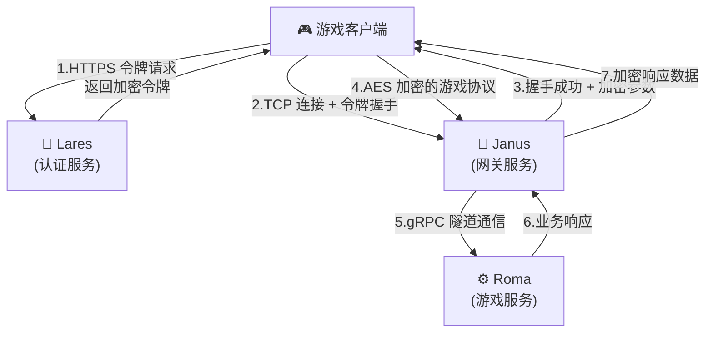
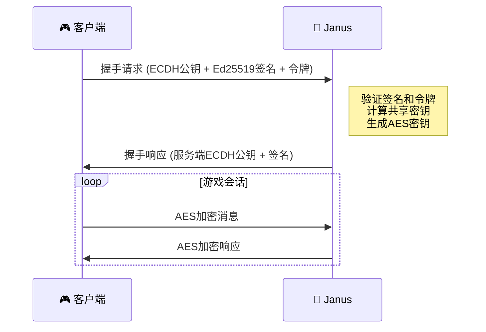

<div align="center">
  <h1>🔰 Janus 游戏网关服务</h1>
  <p><em>go-pantheon 生态系统的高性能游戏网关服务框架</em></p>
</div>

<p align="center">
<a href="https://github.com/go-pantheon/janus/actions"></a>
<a href="https://github.com/go-pantheon/janus/releases"></a>
<a href="https://github.com/go-kratos/kratos"></a>
<a href="https://pkg.go.dev/github.com/go-pantheon/janus"></a>
<a href="https://goreportcard.com/report/github.com/go-pantheon/janus"></a>
<a href="https://github.com/go-pantheon/janus/blob/main/LICENSE"></a>
<a href="https://deepwiki.com/go-pantheon/janus"></a>
</p>

<p align="center">
  <a href="README.md">English</a> | <a href="README_zh.md">中文</a>
</p>

## 关于 Janus

Janus 是基于微服务架构的高性能游戏网关服务，采用 Go 语言开发。作为客户端与后端服务之间的桥梁，提供可扩展、高可靠的连接层，支持多协议接入和智能请求路由。Janus 是 go-pantheon 游戏生态系统的核心网关组件，由 [fabrica-net](https://github.com/go-pantheon/fabrica-net) 网络库提供企业级通信能力。

## 关于 go-pantheon 生态系统

**go-pantheon** 是开箱即用的现代游戏服务器框架，基于微服务架构设计，为游戏开发者提供高性能、高可用的完整解决方案：

- **🔰 Janus** - 游戏网关服务，客户端连接处理和请求转发
- **⚙️ Roma** - 游戏核心逻辑服务，业务逻辑处理中心
- **🔐 Lares** - 用户认证服务，账户管理和身份验证
- **📊 Senate** - 后台管理服务，运营数据和系统管理

## ✨ 核心特性

- 🚀 **高性能**：基于 fabrica-net 的多协议网络服务器，采用工作池架构，支持单服务数万级连接
- 📈 **水平扩展**：无状态设计支持集群部署，可动态扩容应对流量峰值
- 🔒 **安全通信**：Ed25519证书签名的ECDH密钥交换 + AES-GCM加密通信
- ⚡ **智能路由**：基于Redis的三层路由系统和动态负载均衡
- 🛡️ **令牌验证**：与Lares认证服务集成的安全握手机制
- 🔌 **多协议支持**：通过 fabrica-net 统一 API 支持 TCP、KCP (UDP) 和 WebSocket 协议
- 📦 **协议转换**：网络协议与gRPC间的无缝协议转换
- 🔄 **数据压缩**：支持zlib压缩优化网络传输
- 📊 **监控追踪**：集成OpenTelemetry分布式链路追踪和Prometheus指标
- 🎯 **实时推送**：支持消息推送、组播和广播通知

## 🏗️ 系统架构



## 🚀 快速开始

### 环境要求

- Go 1.24+
- etcd 服务 (服务发现)
- Redis 服务 (路由表)

### 安装运行

```bash
# 1. 克隆项目
git clone https://github.com/go-pantheon/janus.git
cd janus

# 2. 初始化依赖
make init

# 3. 生成API代码
make api

# 4. 构建服务
make build

# 5. 启动服务
make run
```

### 配置示例

```yaml
# app/gate/configs/config.yaml
server:
  tcp:
    addr: ":17001"
    timeout: 30s

data:
  redis:
    addr: "127.0.0.1:6379"

registry:
  etcd:
    endpoints: ["127.0.0.1:2379"]
```

## 🎮 支持的游戏模块

| 模块       | 功能描述             |
| ---------- | -------------------- |
| **System** | 握手、心跳、错误处理 |
| **Player** | 玩家数据同步与管理   |
| **Room**   | 房间创建与管理       |
| **Team**   | 队伍系统             |
| **Fight**  | 战斗系统             |
| **Chat**   | 聊天系统             |
| **Guild**  | 公会系统             |

## 🛡️ 安全机制

### ECDH密钥交换流程



## 📋 技术栈

| 技术              | 版本    | 用途           |
| ----------------- | ------- | -------------- |
| Go                | 1.24+   | 主要开发语言   |
| Kratos            | v2.8.4  | 微服务框架     |
| fabrica-net       | v0.0.35 | 多协议网络库   |
| gRPC              | v1.73.0 | 服务通信       |
| etcd              | v3.6.1  | 服务发现       |
| Redis             | v9.10.0 | 路由表缓存     |
| Prometheus        | v1.22.0 | 监控系统       |
| gorilla/websocket | v1.5.3  | WebSocket 实现 |
| xtaci/kcp-go      | v5.6.22 | KCP 协议支持   |

## 🌐 网络协议

Janus 利用强大的 [fabrica-net](https://github.com/go-pantheon/fabrica-net) 库支持多种网络协议：

### TCP 协议
- **高性能**：工作池架构，采用桶式连接管理
- **安全**：AES-GCM 加密，ECDH 密钥交换
- **可扩展**：支持数万并发连接

### KCP 协议（基于 UDP）
- **低延迟**：针对不可靠网络条件优化
- **可靠**：前向纠错（FEC）和自动重传
- **多路复用**：单个 UDP 连接上的流多路复用

### WebSocket 协议
- **Web 兼容**：直接支持浏览器客户端
- **实时**：双向通信
- **路径路由**：可配置端点路由

### 协议选择指南

| 协议      | 使用场景         | 延迟 | 可靠性 | 防火墙友好 |
| --------- | ---------------- | ---- | ------ | ---------- |
| TCP       | 通用游戏流量     | 中等 | 高     | ✅          |
| KCP (UDP) | 实时动作游戏     | 低   | 中等   | ⚠️          |
| WebSocket | 基于浏览器的游戏 | 中等 | 高     | ✅          |

## 🔧 开发指南

### 自定义配置

```bash
# 复制配置模板
cp -r app/gate/configs.tmpl/ app/gate/configs/

# 修改服务配置
vim app/gate/configs/config.yaml

# 修改安全配置
vim app/gate/configs/secret.yaml

# 修改注册中心配置
vim app/gate/configs/registry.yaml
```

### 集成测试

配合 [Roma 游戏服务](https://github.com/go-pantheon/roma) 进行完整测试：

```bash
# 启动 Mercury 模拟客户端
git clone https://github.com/go-pantheon/roma.git
cd roma && make mercury
```

### 监控调试

```bash
# 健康检查
curl http://localhost:18100/health

# 连接统计
curl http://localhost:18100/stats/connections

# 查看日志
make log
```

## 📄 许可证

本项目基于 [MIT LICENSE](LICENSE) 开源协议。

---

<div align="center">
  <p>✨ <strong>高性能游戏网关，为游戏而生</strong> ✨</p>
  <p><em>go-pantheon 生态系统的核心组件</em></p>
</div>
